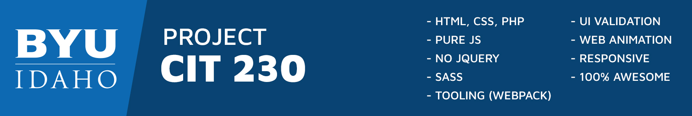

# Website Project - Salmon River Adventure

This is a project for [CIT 230](https://emp.byui.edu/somsenr/cit230/Administrative/cit230-schedule.html) class, on this project is required to plan, design, and build a prototype website for a real-world organization.

Check out the [live version here](https://goo.gl/iRijxu).

## Screenshot

